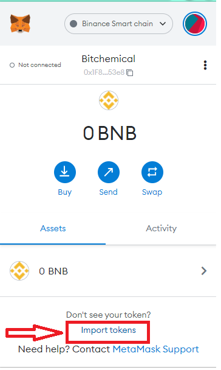
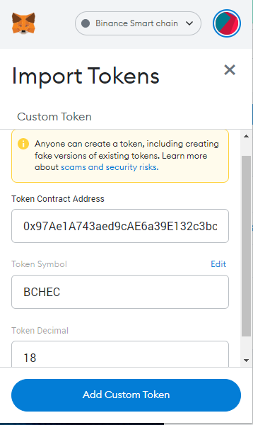
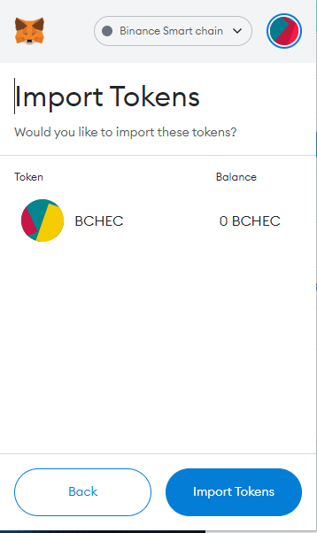
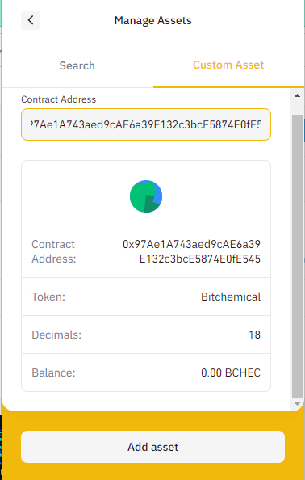
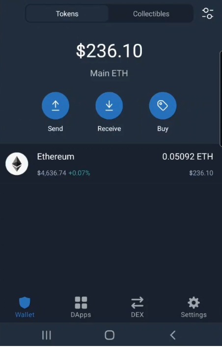
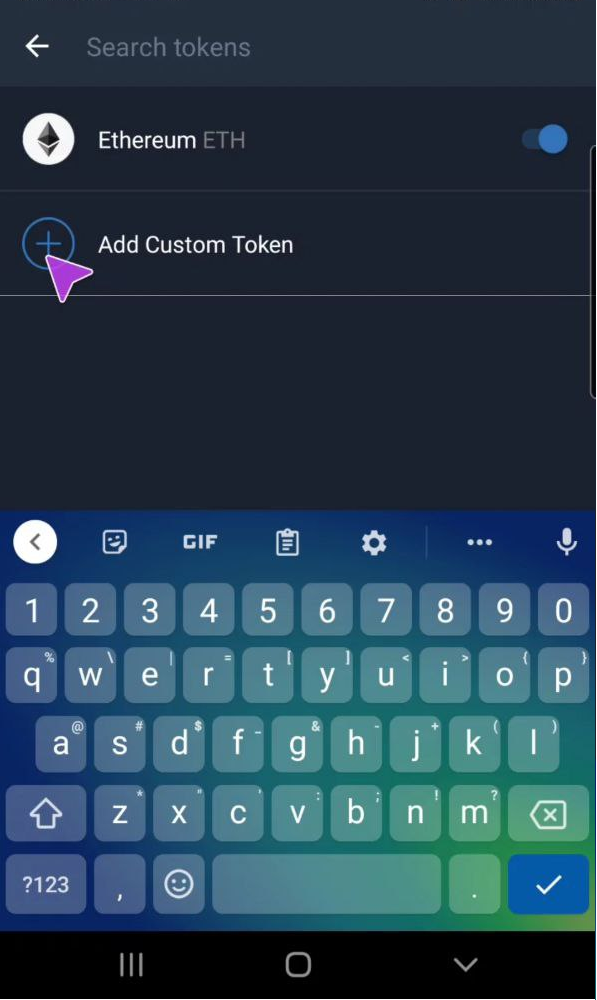
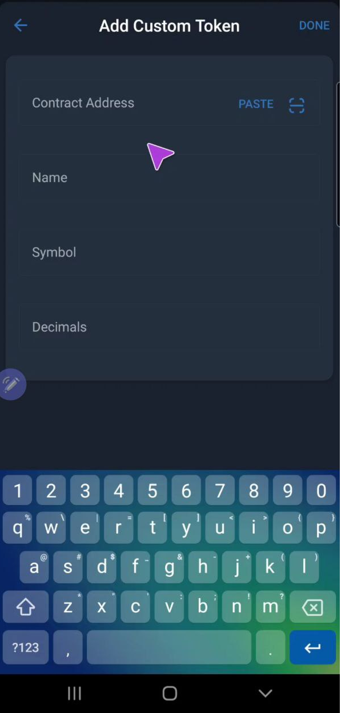

# How To Add A Contract Address To A Wallet?

When purchasing or receiving tokens on the BSC network, tokens may not show in your wallet interface automatically.

In this case, the token's contract address will have to be manually added to your wallet interface. This guide will show you how to perform this on various wallets.


Only add verified contract addresses to your wallet, anyone can create a token so it is important to verify the legitimacy of this information.

To verify a contract address, visit the [token info](broken-reference) page on KnightSwap or verify directly on [BSC Scan.](https://bscscan.com/token/0x97Ae1A743aed9cAE6a39E132c3bcE5874E0fE545)&#x20;




#### Adding contract addresses on MetaMask

To manually add a contract address, first, open your MetaMask desktop wallet and click the 'import tokens' option located on the home page of the wallet.

Paste the address into the 'Token Contract Address' field under "Custom Token"

Once the fields are populated, click 'Add Custom Token'. Then you should see your balance populate (if you have any tokens). Press "Import Token" to finish.

The token address is now added to your wallet and you should see any balances you hold.


The 'Token Symbol' and 'Token Decimal' fields should auto-populate. If not, visit the token contract page on [BSC Scan](https://bscscan.com/token/0x97Ae1A743aed9cAE6a39E132c3bcE5874E0fE545) and view the 'Profile Summary' section to get these details.




#### Adding contract addresses on Binance Wallet

To manually add a contract address, first, open your MetaMask desktop wallet and click the '+' option located on the home page of the wallet.

Once the fields are populated, click 'Custom Asset'.&#x20;

Paste the address into the 'Token Contract Address' field under "Custom Asset"

Then you should see your balance populate (if you have any tokens). Press "Add Asset" to finish.

The token address is now added to your wallet and you should see any balances you hold.



#### Adding contract addresses on TrustWallet for mobile

To manually add a contract address, first, open your TrustWallet mobile app and click the 'settings' option in the bottom right hand side of the screen.

Next select 'Add Custom Token'.

You will be faced with the page in which you have to add the token details. First, in the 'Network' field, select 'Smart Chain'. Then paste the token contract address into the 'Contract Address' field. The rest of the information should auto-populate, if not, visit the token page on [BSC Scan](https://bscscan.com/token/0x97Ae1A743aed9cAE6a39E132c3bcE5874E0fE545) and retrieve the information from the 'Profile Summary' section.

Once all the information is entered, click 'Save' in the top right hand side of the screen. Once this is done, the token is added and you should see the token and any balances you hold.



